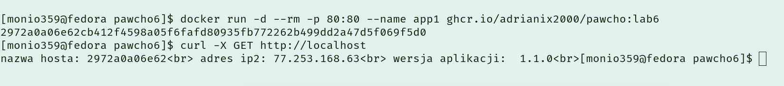

# Lab6 
### Budowanie obrazu za pomocą silnika buildkit na podstawie zewnętrznych źródeł


#### Opis działnia 
---
Pliki źródłowe aplikacji JavaScript wyświetlającej dane serwera, tym razem nie są pobierane z komputera hosta lecz pobierane są ze zdalnego repozytorium github. Aby było możliwe pobieranie źródeł ze zdalnego repo na początku należało zainstalować gita, a klienta openssh żeby się uwierzytelnić kluczem ssh. Za pomocą programu ssh-keyscan pobierany jest klucz hosta dla serwera github a następnie zostaje on dodany do pliku known_hosts w katalogu .ssh, dodanie tego klucza github zapobiega atakom typu man-in-the-middle w których atakujący może podszyć się pod serwer github. Następie pobierane są wszytskie potrzebne źródło oraz instalowane są wszytskie biblioteki JavaScript potzrebne do działania aplikacji.


#### Budowanie obrazu
---

W zadaniu należało budować obraz na podstawie demona build-kita uruchomionego w odzielnym kontenerze więc w zadaniu został uruchomiony kontener na podstawie obrazu moby/buildkit.

```bash 
docker run -d --rm --name buildkitd --privileged moby/buildkit:latest
```

Aby porogram buildctl przy wywołaniu wiedział gdzie znajuduję się demon buildkita należy dodać poniższą zmienną środowiskową

```bash
export BUILDKIT_HOST=docker-container://buildkitd
```

Budowanie obrazu odbywa się przy użyciu programu buildctl, przy budowaniu należało określić gdzie ma znaleźć się zbudowany obraz w tym przypadku zostało wykorzystane repozytorium obrazów ghcr. Na tym etapie podajemy również wartość zmiennej VERSION która wyświetlana jest przez aplikacje. 
```bash
buildctl build --frontend=dockerfile.v0 --ssh default=$SSH_AUTH_SOCK --local context=. --local dockerfile=. --opt build-arg:VERSION=1.0.0 --output type=image,name=ghcr.io/adrianix2000/pawcho:lab6,push=true
```

#### Uruchamianie obrazu
---
Tym razem źródłem skąd pobierany jest obrazy nie jest dockerhub a repozytorium ghcr. Poniższym poleceniem uruchamiamy kontener.

```bash
docker run -d --rm -p 80:80 --name app1 ghcr.io/adrianix2000/pawcho:lab6
```

Następnie za pomocą przeglądarki bądź programu curl sprawdzamy czy nasza aplikacja działa

```bash
curl -X GET http://localhost
```

---

### Wynik działania aplikacji




